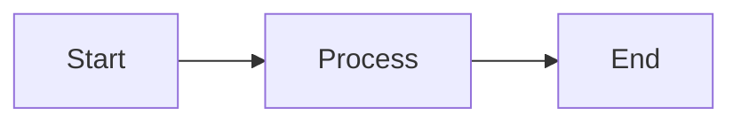
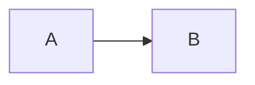

# Mermaid Diagrams Guide

## ✅ What Was Fixed

Your Mermaid diagrams weren't showing because of three issues:

1. **mdxOptions was commented out** - The `options={mdxOptions}` prop in `MDXRemote` was commented out
2. **Mermaid component not in MDXComponents** - The `Mermaid` component wasn't added to the components object
3. **Wrong syntax in blog posts** - Using markdown code blocks instead of the Mermaid component

All three issues have been fixed! ✨

## 📝 How to Use Mermaid in Your Blog Posts

### ✅ Correct Syntax (Use This)

```mdx
<Mermaid chart={`
graph LR
    A[Start] --> B[Process]
    B --> C[End]
`} />
```

### ❌ Old Syntax (Don't Use This)

```mdx

```

## 📊 Mermaid Diagram Types

### 1. Flowchart / Graph

```mdx
<Mermaid chart={`
graph TD
    A[Start] --> B{Decision}
    B -->|Yes| C[Action 1]
    B -->|No| D[Action 2]
    C --> E[End]
    D --> E
`} />
```

### 2. Sequence Diagram

```mdx
<Mermaid chart={`
sequenceDiagram
    participant User
    participant App
    participant API
    
    User->>App: Request
    App->>API: Fetch data
    API-->>App: Response
    App-->>User: Display
`} />
```

### 3. Class Diagram

```mdx
<Mermaid chart={`
classDiagram
    class Animal {
        +String name
        +makeSound()
    }
    class Dog {
        +bark()
    }
    Animal <|-- Dog
`} />
```

### 4. State Diagram

```mdx
<Mermaid chart={`
stateDiagram-v2
    [*] --> Idle
    Idle --> Processing
    Processing --> Success
    Processing --> Error
    Success --> [*]
    Error --> Idle
`} />
```

### 5. Pie Chart

```mdx
<Mermaid chart={`
pie title Project Distribution
    "Development" : 45
    "Testing" : 25
    "Documentation" : 20
    "Deployment" : 10
`} />
```

### 6. Gantt Chart

```mdx
<Mermaid chart={`
gantt
    title Project Timeline
    dateFormat YYYY-MM-DD
    section Planning
    Research :a1, 2026-01-01, 30d
    Design :after a1, 20d
    section Development
    Coding :2026-02-01, 45d
    Testing :2026-03-15, 20d
`} />
```

## 🔄 Converting Existing Blog Posts

If you have existing blog posts with the old syntax, you need to convert them:

**Before:**
```mdx

```

**After:**
```mdx
<Mermaid chart={`
graph LR
    A --> B
`} />
```

## 🛠️ Files Modified

1. **app/[locale]/blog/[slug]/page.tsx**
   - Enabled `options={mdxOptions}` in MDXRemote
   - Cleaned up mdxOptions configuration

2. **components/mdx/MDXComponents.tsx**
   - Added Mermaid import
   - Added Mermaid to components export

3. **blogs/vi/1.generative-ai-sap-enterprise-workflows.mdx**
   - Updated to use correct Mermaid syntax (as an example)

4. **blogs/en/mermaid-example.mdx** (NEW)
   - Created example blog post with various Mermaid diagrams

## 🧪 Testing

To test if Mermaid is working:

1. Start your dev server: `pnpm dev`
2. Navigate to: `http://localhost:3000/en/blog/mermaid-example`
3. You should see all the Mermaid diagrams rendered correctly

## 📚 Resources

- [Mermaid Live Editor](https://mermaid.live) - Test your diagrams
- [Mermaid Documentation](https://mermaid.js.org/) - Full syntax reference
- [mdx-mermaid GitHub](https://github.com/sjwall/mdx-mermaid) - Component documentation

## 💡 Tips

1. Always use backticks (`) to wrap the chart definition
2. Test complex diagrams in the Mermaid Live Editor first
3. Keep diagrams simple for better readability
4. Use meaningful node labels
5. Add comments in your Mermaid code for complex diagrams

